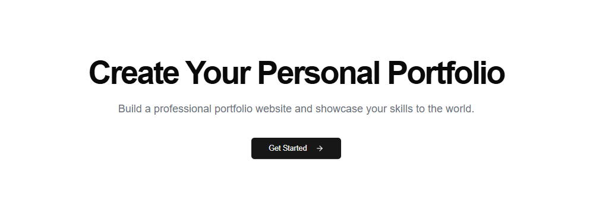
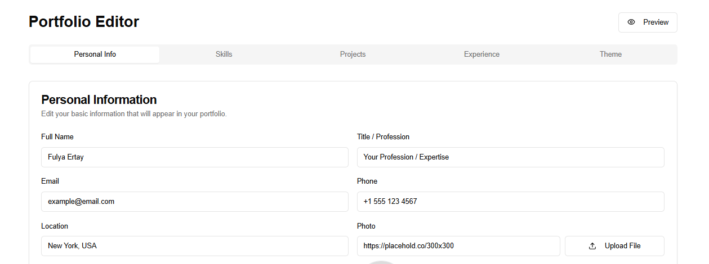
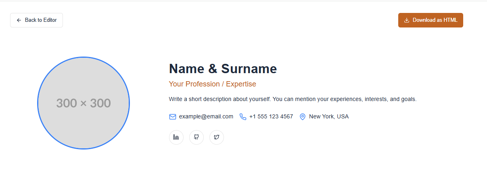

# Portfolio Creator

A modern web application that allows users to create and customize their personal portfolio websites without writing any code.
## [Website Live Link here](https://portfolio-creator-web-app.vercel.app/)
## Features

### 1. Personal Information Management
- Name, title, and profile photo
- Contact information (email, phone, location)
- Social media links (LinkedIn, GitHub, Twitter)
- Personal description

### 2. Skills Section
- Skill name and proficiency level (percentage)
- Visual progress bars for skill representation

### 3. Projects Section
- Project title and description
- Project image
- Project link

### 4. Work Experience
- Company name
- Position
- Employment dates
- Job description

### 5. Theme Customization
- Primary color
- Text color
- Background color
- Accent color

### 6. Preview and Export
- Live portfolio preview
- HTML export option

## Screenshots

### Home Page

### Edit Portfolio Page

### Preview Page

## How to Use

1. Click the "Get Started" button on the homepage
2. Navigate to the dashboard to edit your portfolio information
3. Use the preview page to see how your portfolio will look
4. Export your portfolio as HTML when ready

## Technical Stack

- Next.js (React framework)
- TypeScript
- Tailwind CSS
- Shadcn/ui (UI components)

